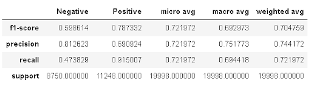
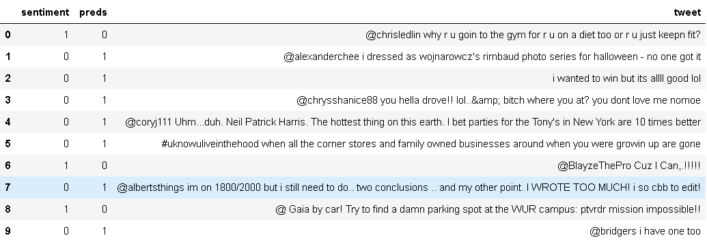

# TwitterSentimentAnalysis
 
**Problem**

The aim of this project is to extract the sentiment of tweets and classifying it as either a positive or a negative sentiment. A solution to this problem is important to a wide variety of domains

**Dataset**

The data that I will be using is of 100,000 tweets each marked with either a positive or a negative tweet. The dataset can be easily downloaded from [here](https://datahack.analyticsvidhya.com/contest/practice-problem-twitter-sentiment-analysis/). 

The dataset is available as a csv file and has essentially 2 columns of interest.

1. Sentiment - 0,1 (Negative,Positive)
2. Tweet - The text associated with the sentiment

**Data Preprocessing**

The tweets were processed according to the following and in the same order.

1. Tags removal (i.e ‘@’)
2. Lowercasing
3. Numbers removal
4. HTTP links removal
5. Emojis were processed. Emojis were labelled EMO_POS or EMO_NEG 
6. Punctuation removal
7. Removed extra white spaces
8. Words which did not consist of alphabets were removed
9. Stop words were removed (These words add no value to the sentiment of the tweet e.g The, He etc)
10. Character repetitions were removed e.g _funnny _was changed to _funny_
11. Words were lemmatized to bring to their basic form e.g adventurous changed to adventure

**Exploratory Data Analysis**

**Distribution of sentiments**

As can be seen below, both sentiments are somewhat balanced

**Distribution of lengths of tweets**

We can also see below that the lengths of both the sentiments follow the same distribution.

**Word Clouds and Word frequency plots**

_Positive Sentiments_

We can see that for the positive sentiment words like lol,thank, love, good show up more frequently.

_Negative Sentiments_

For the negative sentiment words like miss, work, sad, wish are more frequent.

**Modeling strategy**

I have approached the sentiment extraction through 3 feature extraction methods.

1. Bag of Words  - Each processed tweet is considered a set of words. (Used the 3000 most frequent words)
2. Term Frequency Inverse Document Frequency - **TF-IDF** is a numerical statistic that is intended to reflect how important a word is to a document in a collection or corpus. Here each word is assigned a weight that reflects how frequent it is in that tweet in comparison to all the tweets. (Used 3000 most frequent words)
3. Word Embeddings - This technique converts the words into mathematical vectors based how their similarity to other words. (1000 word embeddings were used. The vectors were rounded to 3 decimal places to reduce the training time of the models)

For each feature extraction method 6 machine learning approaches are used 

1. Logistic Regression
2. SVM
3. XGBoost
4. NaiveBayes
5. Decision Tree
6. Random Forest

The dataset is used as per the following scheme for each method - model iteration

<table>
  <tr>
   <td>
   </td>
   <td>All data
   </td>
   <td>Training data
   </td>
   <td>Cross Validation data
   </td>
   <td>Test data
   </td>
  </tr>
  <tr>
   <td>Percentage
   </td>
   <td>100%
   </td>
   <td>72%
   </td>
   <td>8%
   </td>
   <td>20%
   </td>
  </tr>
  <tr>
   <td>Tweets
   </td>
   <td>100,000
   </td>
   <td>72,000
   </td>
   <td>8,000
   </td>
   <td>20,000
   </td>
  </tr>
</table>

All the models are optimized for accuracy. Each models own subset of hyperparameters are tuned using the cross-validation data. They were cross validated using a shuffled 3-fold split.

The code has been set up so that each iteration receives the same data training and validation data and is entirely reproducible.

**_Note:_**

_NaiveBayes model for Word2Vec was NOT trained because word vectors can take negative values and NaiveBayes does not handle them. One work around could be to apply MinMax scaling to the Word embeddings but that would void the homogeneity of the validation process._

**Results**

The following table shows the results of all the models and methods. The best performing method-model row is highlighted

We can see from the results that the all the metrics are higher for **SVM Classifier with TF-IDF**.

We can also notice that the Decision tree models were overfit and the Word Embeddings feature performed poorly.

The following are the ROC and the class-wise metrics for the best performing (SVM - TFIDF) model

_Test Accuracy : 72.20%_

_Confusion Matrix_

We can see that 16% of the error is because of  False Negatives while 9.6% is due to False Positives. We can observe the same in the classification report below as well. The lower f1-score for Negative sentiments indicates that it is relatively harder to predict a negative sentiment correctly.

**Error Analysis**

We have seen the SVM with TF-IDF performs the best. The following is a sample of misclassifications.

_Observations:_

1. We can see that some tweets cannot be classified as either positive or negative. They don't have a sentiment in them. For example tweet 0 is neither positive or negative. However the truth value associated with it is positive. It should be classified as Neutral. More examples are 1,9
2. Some tweets have both a positive and a negative sentiment e.g _‘i wanted to win but it's allll good lol’_. They can not be labelled either positive or negative in entirety. 
3. Wrong labeling in the Training data e.g. 8. This should have been a negative sentiment.

Other than the observations highlighted further improvement can be made by tuning the model further or trying a more sophisticated technique.

**Further improvements**

1. Use more features to train the models for TFIDF.
2. Use a sophisticated model like deep learning where the models are trained with the context of a window of words.
3. BOW and TFIDF can be used with 2-grams or 3-grams
4. Training dataset can be refined to be more accurate.
5. Exclamation marks could be handled specially during the preprocessing of the tweets.

